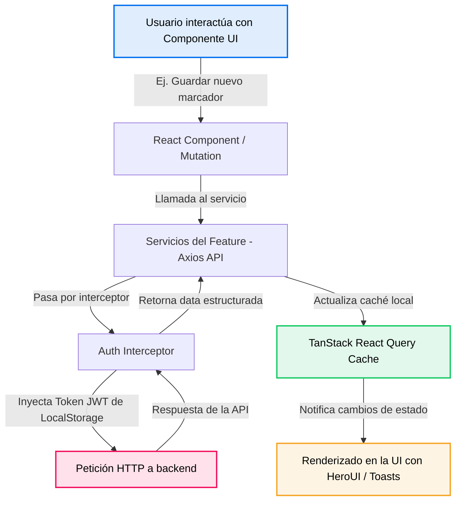

# Tobimarks Web App

Tobimarks es una aplicación web moderna, rápida y con diseño de alta calidad para la gestión y organización inteligente de marcadores (enlaces web). Diseñada con una interfaz altamente responsiva e interactiva, permite a los usuarios consolidar sus enlaces, categorizarlos en colecciones personalizadas, organizarlos con etiquetas dinámicas, y beneficiarse de automatizaciones basadas en Inteligencia Artificial (como el auto-etiquetado y la auto-categorización).

La plataforma cuenta con un sistema de autenticación seguro mediante Google OAuth, soporte nativo de temas claro y oscuro con transiciones fluidas, y estadísticas en tiempo real en un panel principal (Dashboard).

---

## Tabla de Contenidos

- [Características Principales](#características-principales)
- [Pila Tecnológica (Tech Stack)](#pila-tecnológica-tech-stack)
- [Arquitectura del Proyecto](#arquitectura-del-proyecto)
  - [Estructura de Directorios](#estructura-de-directorios)
  - [Flujo de Datos y Ciclo de Vida de las Peticiones](#flujo-de-datos-y-ciclo-de-vida-de-las-peticiones)
  - [Modelos de Datos Principales (TypeScript)](#modelos-de-datos-principales-typescript)
- [Requisitos Previos](#requisitos-previos)
- [Instalación y Configuración Local](#instalación-y-configuración-local)
  - [1. Clonar el repositorio](#1-clonar-el-repositorio)
  - [2. Instalar dependencias](#2-instalar-dependencias)
  - [3. Configurar variables de entorno](#3-configurar-variables-de-entorno)
  - [4. Iniciar el servidor de desarrollo](#4-iniciar-el-servidor-de-desarrollo)
- [Guía de Scripts Disponibles](#guía-de-scripts-disponibles)
- [Variables de Entorno](#variables-de-entorno)
- [Pruebas y Calidad de Código](#pruebas-y-calidad-de-código)
- [Despliegue](#despliegue)
  - [Vercel (Recomendado)](#vercel-recomendado)
  - [Netlify](#netlify)
  - [Docker (Servidor Estático Nginx)](#docker-servidor-estático-nginx)
- [Resolución de Problemas Comunes (Troubleshooting)](#resolución-de-problemas-comunes-troubleshooting)

---

## Características Principales

*   **Autenticación Integrada con Google OAuth:** Acceso rápido y seguro utilizando la API oficial de Google (`@react-oauth/google`).
*   **Gestión Completa de Marcadores (CRUD):** Permite añadir, editar, visualizar y eliminar marcadores de forma interactiva.
*   **Organización por Colecciones:** Agrupa marcadores en carpetas o colecciones con colores e iconos personalizables.
*   **Sistema de Etiquetas Dinámicas (Tags):** Etiqueta tus enlaces para realizar filtros rápidos. Los colores de las etiquetas facilitan la identificación visual.
*   **Dashboard con Estadísticas:** Visualiza de un vistazo la cantidad total de marcadores guardados, colecciones creadas y etiquetas registradas en el sistema.
*   **Automatización con Inteligencia Artificial:** 
    *   *Auto-Etiquetado Inteligente:* La IA analiza el contenido del sitio web del marcador y le asigna las etiquetas más relevantes de forma automática.
    *   *Auto-Categorización:* La IA sugiere y auto-asigna la colección adecuada basada en la semántica del enlace.
*   **Diseño Premium y Soporte de Temas:** Estilizado minuciosamente con Tailwind CSS v4 y componentes interactivos de HeroUI v3. Incluye soporte de tema claro/oscuro completo y persistente (`next-themes`).
*   **Búsqueda y Filtros Avanzados:** Filtra marcadores por favoritos, rango de fechas de último acceso (semana, mes, histórico), etiquetas específicas, y ordena por fecha de creación, último acceso o cantidad de visitas.

---

## Pila Tecnológica (Tech Stack)

La aplicación aprovecha las últimas versiones y mejores prácticas del ecosistema frontend moderno:

*   **Núcleo:** [React 19](https://react.dev/) y [TypeScript](https://www.typescriptlang.org/) para un tipado estático seguro y robusto.
*   **Empaquetador/Entorno:** [Vite 7](https://vite.dev/) para compilaciones y HMR (Hot Module Replacement) ultrarrápidos.
*   **Estilos y Componentes:**
    *   [Tailwind CSS v4](https://tailwindcss.com/) (usando el nuevo compilador `@tailwindcss/vite` de alto rendimiento).
    *   [HeroUI v3](https://heroui.com/) (antiguo NextUI v2, componentes UI de alta calidad basados en React Aria).
    *   [Lucide React](https://lucide.dev/) para un set de iconos vectoriales consistentes y modernos.
*   **Enrutado:** [React Router v7](https://reactrouter.com/) para una gestión de navegación fluida.
*   **Estado del Servidor (Server State):** [TanStack React Query v5](https://tanstack.com/query/latest) para el almacenamiento en caché de peticiones, revalidaciones automáticas y sincronización óptima con la API.
*   **Estado del Cliente (Client State):** [Zustand v5](https://zustand.docs.pmnd.rs/) para estados globales livianos (ej. estado de sesión, colapso de sidebar).
*   **Cliente HTTP:** [Axios](https://axios-http.com/) con interceptores globales para inyección de tokens JWT y redirecciones inteligentes.
*   **Gestión de Temas:** [next-themes](https://github.com/pacocoursey/next-themes) para alternar fluidamente entre modo oscuro y claro de forma persistente en el navegador.

---

## Arquitectura del Proyecto

Tobimarks utiliza una arquitectura **basada en características (Feature-Driven Architecture)**, lo que promueve una alta modularidad, desacoplamiento y escalabilidad de la base de código.

### Estructura de Directorios

```text
tobimarks-web-app/
├── .agent/                 # Configuraciones internas del agente
├── dist/                   # Directorio de salida tras la compilación de producción
├── public/                 # Recursos estáticos servidos directamente (ej. logos, iconos)
├── src/                    # Código fuente principal de la aplicación
│   ├── assets/             # Estilos globales y configuraciones de fuentes
│   ├── core/               # Módulos transversales y recursos compartidos de la app
│   │   ├── components/     # Componentes compartidos globales (ej. Header, Sidebar, ColorPicker)
│   │   ├── config/         # Configuraciones globales y variables de entorno (`env.ts`)
│   │   ├── constants/      # Constantes globales (ej. llaves de almacenamiento en localStorage)
│   │   ├── interceptors/   # Interceptores de Axios para tokens de autorización (`auth.interceptor.ts`)
│   │   ├── layouts/        # Envolturas de diseño de la aplicación (ej. `AuthLayout.tsx`)
│   │   └── providers/      # Proveedores de contexto globales (ej. `AuthProvider.tsx` para manejo de auth)
│   ├── features/           # Módulos autocontenidos ordenados por área de negocio/característica
│   │   ├── auth/           # Flujo de login, servicios de inicio de sesión con Google y Zustand Store
│   │   ├── bookmarks/      # CRUD de marcadores, filtros avanzados, vistas de tarjetas y servicios de API
│   │   ├── collections/    # CRUD de colecciones, selección de iconos, paletas de colores y páginas de detalle
│   │   ├── home/           # Página de inicio/Dashboard del usuario
│   │   ├── statistics/     # Resumen analítico del contenido del usuario
│   │   ├── tags/           # Gestión global de tags, selectores y asignación de colores
│   │   └── user/           # Perfil del usuario, visualización de datos y switches de IA
│   ├── App.tsx             # Enrutador principal de la aplicación (React Router)
│   ├── hero.ts             # Configuración del tema personalizado de HeroUI (colores HSL y OKLCH)
│   ├── index.css           # Punto de entrada de CSS de Tailwind CSS v4 con variables CSS
│   ├── main.tsx            # Punto de entrada de la aplicación para el montaje del DOM de React
│   └── providers.tsx       # Envoltura centralizada de todos los contextos (QueryClient, Themes, GoogleOAuth)
├── .env.example            # Plantilla de variables de entorno requeridas
├── eslint.config.js        # Configuración de ESLint (Flat Config)
├── index.html              # Entrada HTML principal con etiquetas SEO y Open Graph
├── package.json            # Lista de dependencias, scripts de ejecución y metadatos
├── tsconfig.json           # Configuración de TypeScript de la aplicación
├── vercel.json             # Reglas de redirección de rutas para SPA en Vercel
└── vite.config.ts          # Configuración de Vite (plugins de React, Tailwind y Tsconfig Paths)
```

### Flujo de Datos y Ciclo de Vida de las Peticiones



1.  **Interacción de la UI:** El usuario ejecuta una acción (ej. marca un enlace como favorito o añade un marcador).
2.  **Mutación y Caché:** Un hook de React Query (mutación) ejecuta la petición correspondiente y administra el ciclo de vida de la transacción.
3.  **Interceptor HTTP:** Axios envía la solicitud. El interceptor centralizado (`src/core/interceptors/auth.interceptor.ts`) intercepta la petición para inyectar la cabecera `Authorization: Bearer <JWT>` si el token existe en el almacenamiento persistente del cliente.
4.  **Respuesta e Invalidación:** Al retornar éxito desde el backend, React Query invalida automáticamente la query clave vinculada (ej. `['bookmarks']`), disparando un refrescado pasivo en segundo plano.
5.  **Notificación Visual:** El componente `<Toast.Provider>` de HeroUI muestra notificaciones contextuales flotantes de éxito o error al usuario.

---

### Modelos de Datos Principales (TypeScript)

Los modelos de datos de la aplicación están fuertemente tipados en sus respectivos archivos de tipos dentro de cada feature:

#### Usuario (`User`)
Representa el perfil de la cuenta de usuario autenticada con sus configuraciones de IA activas.
```typescript
export interface User {
  id: string
  email: string
  displayName: string
  avatarUrl: string | null
  settings: {
    aiAutoTags: boolean
    aiAutoCollections: boolean
  }
}
```

#### Marcador (`Bookmark`)
Representa el enlace web guardado por el usuario con metadatos asociados extraídos del sitio web (dominio, favicon) y relaciones a tags y colecciones.
```typescript
export interface Bookmark {
  id: string
  websiteId: string
  url: string
  title: string
  description: string | null
  isFavorite: boolean
  isArchived: boolean
  lastAccessedAt: Date | null
  accessCount: number
  tags: Tag[]
  collectionId?: string | null
}
```

#### Colección (`Collection`)
Representa una carpeta de organización con personalización visual.
```typescript
export interface Collection {
  id: string
  userId: string
  name: string
  description: string | null
  icon: CollectionIcon | null // ej. 'folder', 'star', 'archive', etc.
  color: CollectionColor | null // ej. 'blue', 'green', 'rose', etc.
  bookmarksCount: number
  createdAt: Date
  updatedAt: Date
}
```

#### Etiqueta (`Tag`)
Representa etiquetas aplicadas a los marcadores a nivel de sistema.
```typescript
export interface Tag {
  id: string
  name: string
  slug: string
  color: ColorKey // Colores HSL adaptados de la paleta
}
```

---

## Requisitos Previos

Asegúrate de contar con las siguientes herramientas en tu entorno local antes de instalar la aplicación:

*   **Node.js**: Versión `20.x` o superior (se recomienda LTS).
*   **Administrador de paquetes**: `npm` (v10+ recomendado) o en su defecto `pnpm` / `yarn`.
*   **Tobimarks API (Backend)**: Debes contar con la URL de la API del backend levantada en tu red local o producción. El puerto por defecto del backend suele ser el `3000`.
*   **Consola de Google Cloud**: Necesitarás crear un proyecto de Google Cloud con el inicio de sesión OAuth habilitado para obtener una credencial `Client ID` de cliente web.

---

## Instalación y Configuración Local

### 1. Clonar el repositorio

```bash
git clone https://github.com/Jose-Maykol/tobimarks-web-app.git
cd tobimarks-web-app
```

### 2. Instalar dependencias

Utiliza tu administrador de paquetes preferido (este repositorio cuenta con un archivo `package-lock.json` de npm):

```bash
npm install
```

### 3. Configurar variables de entorno

Copia el archivo de plantilla `.env.example` en un nuevo archivo llamado `.env` en la raíz del proyecto:

```bash
cp .env.example .env
```

Abre el archivo `.env` recién creado y define los valores según tu configuración local:

```env
VITE_API_URL=http://localhost:3000
VITE_GOOGLE_CLIENT_ID=tu-id-de-cliente-google.apps.googleusercontent.com
```

*   **`VITE_API_URL`**: La dirección base donde escucha tu servidor backend.
*   **`VITE_GOOGLE_CLIENT_ID`**: ID de cliente obtenido en la consola de APIs de Google (OAuth 2.0).

> [!IMPORTANT]
> En aplicaciones Vite, las variables de entorno destinadas a exponerse en el cliente web deben ir prefijadas de forma obligatoria con la palabra clave `VITE_`.

### 4. Iniciar el servidor de desarrollo

Ejecuta el servidor local de desarrollo:

```bash
npm run dev
```

Por defecto, la aplicación estará disponible en [http://localhost:5173](http://localhost:5173). La interfaz responderá dinámicamente gracias a HMR ante cualquier cambio en el código fuente.

---

## Guía de Scripts Disponibles

El archivo `package.json` incluye los siguientes comandos para la automatización del ciclo de desarrollo:

| Comando | Acción del Script |
| :--- | :--- |
| `npm run dev` | Inicia el servidor de desarrollo local de Vite en el puerto `5173`. |
| `npm run build` | Ejecuta la verificación de tipos de TypeScript (`tsc -b`) y empaqueta el build estático optimizado en la carpeta `/dist`. |
| `npm run lint` | Ejecuta ESLint a lo largo del codebase usando las reglas configuradas en el archivo flat config `eslint.config.js`. |
| `npm run preview` | Levanta un servidor web local para visualizar y probar el build compilado del directorio `/dist`. |

---

## Variables de Entorno

A continuación se detalla el uso y alcance de las variables requeridas en desarrollo y producción:

| Variable | Tipo | Obligatorio | Propósito / Alcance |
| :--- | :--- | :---: | :--- |
| `VITE_API_URL` | String (URL) | Sí | Define la URL base de la API backend de Tobimarks. El cliente web la utiliza para solicitudes Axios (ej. `http://localhost:3000`). |
| `VITE_GOOGLE_CLIENT_ID` | String | Sí | Permite inicializar el proveedor `@react-oauth/google` en `src/providers.tsx` para habilitar el login social de Google en la pantalla de login. |

---

## Pruebas y Calidad de Código

### Verificación Manual
Para probar la aplicación localmente de forma integral:
1. Asegúrate de tener levantado el backend y la base de datos correspondiente.
2. Inicia sesión en la interfaz mediante Google.
3. Añade enlaces para probar las peticiones al backend.
4. Verifica los filtros de etiquetas, la creación de colecciones y el switch de Inteligencia Artificial en la página de perfil.

### Linters y Formateadores
El proyecto utiliza ESLint y Prettier de forma unificada para asegurar un formato consistente del código y evitar antipatrones comunes. Puedes ejecutar el analizador estático con:

```bash
npm run lint
```

Para dar formato de forma automática a los archivos del codebase bajo la especificación establecida en `.prettierrc.js`, puedes utilizar:

```bash
npx prettier --write .
```

---

## Despliegue

La aplicación se compila a un conjunto de archivos estáticos HTML/JS/CSS puros en el directorio `/dist` al correr `npm run build`. Esto significa que puede ser alojada de forma económica en cualquier proveedor de CDN de manera casi instantánea.

### Vercel (Recomendado)

Vercel tiene soporte nativo sin configuración adicional para proyectos Vite:

1.  Crea un nuevo proyecto en tu panel de Vercel e importa el repositorio de GitHub de Tobimarks Web App.
2.  En la sección **Environment Variables**, añade las variables `VITE_API_URL` y `VITE_GOOGLE_CLIENT_ID`.
3.  Vercel detectará Vite automáticamente, estableciendo el comando de construcción a `npm run build` y el directorio de salida a `dist`.
4.  Haz clic en **Deploy**. Las rutas SPA se manejarán correctamente gracias al archivo `vercel.json` incluido en la raíz.

### Netlify

Netlify puede conectarse a tu repositorio para generar despliegues automáticos:

1.  Importa el proyecto en Netlify.
2.  Configura el build settings con:
    *   **Build Command**: `npm run build`
    *   **Publish directory**: `dist`
3.  Añade tus variables de entorno en Site Settings.
4.  Despliega. *Nota: Para corregir errores de enrutamiento SPA en Netlify, puedes añadir un archivo `_redirects` en la carpeta `public/` con el contenido: `/* /index.html 200`.*

### Docker (Servidor Estático Nginx)

Para montar un contenedor de Docker autocontenido que compile la aplicación y la sirva a través de Nginx:

1.  Crea un archivo `Dockerfile` en el directorio raíz del proyecto con la siguiente estructura:

```dockerfile
# Etapa de construcción
FROM node:20-alpine AS builder
WORKDIR /app
COPY package*.json ./
RUN npm ci
COPY . .
# Opcional: define variables de entorno de compilación de ser necesario
ARG VITE_API_URL
ARG VITE_GOOGLE_CLIENT_ID
ENV VITE_API_URL=$VITE_API_URL
ENV VITE_GOOGLE_CLIENT_ID=$VITE_GOOGLE_CLIENT_ID
RUN npm run build

# Etapa de ejecución (Nginx)
FROM nginx:alpine
COPY --from=builder /app/dist /usr/share/nginx/html
# Copia una configuración personalizada para soportar SPA de React
COPY nginx.conf /etc/nginx/conf.d/default.conf
EXPOSE 80
CMD ["nginx", "-g", "daemon off;"]
```

2.  Crea el archivo `nginx.conf` correspondiente para que Nginx no lance errores 404 al refrescar las rutas internas del enrutador SPA de React:

```nginx
server {
    listen 80;
    server_name localhost;

    location / {
        root /usr/share/nginx/html;
        index index.html index.htm;
        try_files $uri $uri/ /index.html;
    }

    error_page 500 502 503 504 /50x.html;
    location = /50x.html {
        root /usr/share/nginx/html;
    }
}
```

3.  Construye la imagen Docker y ponla en funcionamiento:

```bash
docker build -t tobimarks-web-app --build-arg VITE_API_URL=http://tuapi.com --build-arg VITE_GOOGLE_CLIENT_ID=tuid.googleusercontent.com .
docker run -p 8080:80 tobimarks-web-app
```

---

## Resolución de Problemas Comunes (Troubleshooting)

### API Connection Issues (Errores de conexión de API)
*   **Problema:** Los marcadores se quedan cargando permanentemente o las llamadas de red devuelven errores de tipo `Network Error` en la consola.
*   **Solución:** Asegúrate de que el servidor backend esté corriendo y escuchando en la dirección especificada en la variable `VITE_API_URL`. Confirma también que no haya un slash final (`/`) al definir la dirección (ej. `http://localhost:3000` es correcto; `http://localhost:3000/` puede provocar URLs de peticiones mal formadas como `http://localhost:3000//api/bookmarks`).

### Google Login Fails (El login de Google falla o se abre una ventana en blanco)
*   **Problema:** Al hacer clic en iniciar sesión, la ventana modal emergente se cierra de forma abrupta o muestra un error de origen.
*   **Solución:** 
    1. Revisa que el ID de cliente `VITE_GOOGLE_CLIENT_ID` sea exactamente el mismo que tienes configurado en Google Developer Console.
    2. En el panel de Google Cloud de tu credencial OAuth, asegúrate de añadir las URLs locales exactas bajo la sección **Orígenes de JavaScript autorizados** (ej. `http://localhost:5173` y opcionalmente `http://localhost:5173/`). Ten en cuenta que Google no permite redirecciones o llamadas OAuth desde direcciones de origen IP desnudas como `http://127.0.0.1:5173`.

### Errores 404 al Refrescar Rutas (Vercel, Netlify o VPS)
*   **Problema:** Al acceder a `/bookmarks` o `/profile` directamente mediante la URL del navegador o refrescar la página, se visualiza un error `404 Not Found` en producción.
*   **Solución:** Esto ocurre porque el servidor de hosting intenta localizar un archivo real llamado `bookmarks` en el servidor físico. Al ser una SPA (Single Page Application), todas las rutas deben redireccionarse a `index.html`. 
    *   *En Vercel:* Esto se soluciona de forma predeterminada con el archivo `vercel.json` incluido en la raíz de este proyecto.
    *   *En Netlify:* Crea un archivo `_redirects` en la carpeta `public/` con la regla de redirección `/* /index.html 200`.
    *   *En Nginx:* Asegúrate de incluir la directiva `try_files $uri $uri/ /index.html;` en el bloque de localización `/` en la configuración de Nginx.
